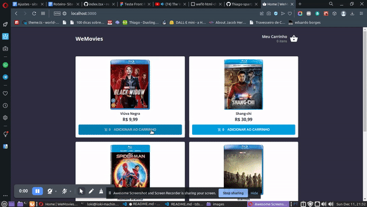

# WeMovies 😉

## About

A sample wecommerce to use test cart applications and contexts.

## Screenshots

<div align="center" id="top">
  
</div>
<br/>

## Features

- API usage by serverless.
- Layout based on mobile users.
- micro-front-end architecture.

## Technologies

The following tools were used in this project:

- [React](https://pt-br.reactjs.org/)
- [TypeScript](https://typescriptlang.org/)
- [Next](https://nextjs.org)
- [React Query](https://react-query-v3.tanstack.com)

## Requirements

Before starting 🏁, you need to have [Git](https://git-scm.com) and [Node](https://nodejs.org/en/) installed.

### Starting

```bash
# Clone this project
$ git clone git@github.com:Thiago-spart/wefit-challenger.git

# Access
$ cd wefit-challenger

# Install dependencies
$ npm i

# Run fake json server
$ npm run json-server

# The server fake server will initialize in <http://localhost:3333>

# Run the project in developer mode
$ npm run dev

# The server will initialize in <http://localhost:3000>
```

Made with ❤️ and ☕

<a href="#top">Back to top</a>
